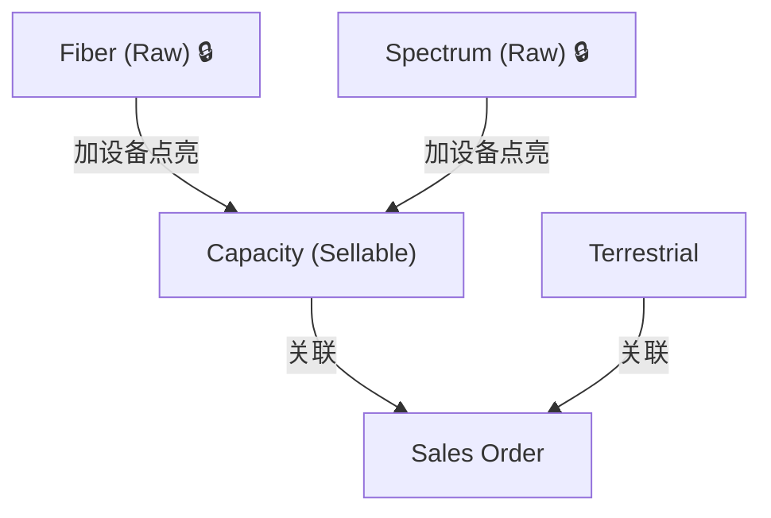

# Cable Inventory Manager — Full Rewrite Plan

## Change Log

| Date | Changes |
|------|---------|
| **2025-02-23** | Initial design proposal: tech stack (React+Vite+Tailwind+shadcn/ui), 4 resource types (Fiber🔒/Spectrum🔒/Capacity/Terrestrial), auto-status from Sales, Base+Batch, searchable dropdowns with add-new, Reference Data as standalone module, Column Picker, Expandable Rows, IRU financial model (OTC + O&M Rate 4% + Annual O&M with manual override), TeleGeography data scraped (688 cables, 1906 landing stations, 186 countries), UI mockups drafted (Dark Mode) |

---

## 概述

**全面重写** Cable Inventory Manager，从 Vanilla JS SPA 迁移至 React 现代技术栈，同时重新设计 Inventory 模块。

### 新技术栈

| 层 | 技术 | 说明 |
|---|------|------|
| **框架** | React 19 + Vite 6 | 纯客户端 SPA，打包成静态文件 |
| **UI** | Tailwind CSS 4 + shadcn/ui | 免费组件库，可复制源码自由修改 |
| **路由** | React Router v7 | 客户端路由，支持 GitHub Pages |
| **后端** | Supabase | PostgreSQL + Auth + RLS（保持不变） |
| **部署** | GitHub Pages | 静态托管，GitHub Actions 自动部署 |

### 重写范围

| 模块 | 策略 |
|------|------|
| **Inventory** | 全新设计（四分类 + 参考数据 + 自动状态） |
| **Sales** | 重写 UI，保留业务逻辑（MVP 阶段 profitability 继续禁用） |
| **CRM (Customers/Suppliers)** | 重写 UI，逻辑简单直接迁移 |
| **Reference Data** | 新增模块（Cable Systems / Landing Stations / Countries / Handover Locations） |
| **Dashboard** | 暂不实现（继续 Under Construction） |
| **Auth** | 重写为 React + Supabase Auth |

### 导航结构

```
Sidebar:
├── 📦 Inventory          ← 主功能
├── 📋 Sales              ← 主功能
├── 👥 Customers          ← CRM
├── 🏬 Suppliers          ← CRM
├── ⚙️ Reference Data     ← 新增！独立导航入口
│   ├── Cable Systems
│   ├── Landing Stations
│   ├── Countries
│   └── Handover Locations
└── 📊 Dashboard          ← Under Construction
```

---

## Inventory 模块设计

## 1. 资源分类（Resource Type）

四种类型（新增 Terrestrial）：

| 类型 | 描述 | 单位 | 当前状态 |
|------|------|------|---------|
| **Fiber** | 裸光纤对 | Fiber Pair | 🔒 Coming Soon |
| **Spectrum** | 频谱资源 | GHz | 🔒 Coming Soon |
| **Capacity** | 已点亮的带宽容量 | 按规格 | ✅ 完整实现 |
| **Terrestrial** | 陆地线路资源 | 按规格 | ✅ 完整实现 |

### 资源层级关系



### Capacity / Terrestrial 规格

预设选项 + 支持自由输入（覆盖 300G 等非标规格）：

```
Spec: [10G] [40G] [100G] [300G✏️] [400G] [800G] [1.6T] [自定义...]
```

> 使用 Combobox 组件：下拉预设值 + 允许手动输入任意值。

---

## 2. 表单字段设计

### ID 字段

| 字段 | 说明 |
|------|------|
| **Resource ID** | 系统自动生成（`RES-XXXXX`），唯一标识符，不可编辑 |
| **Internal Ref** | 用户填写的公司内部编号 |

### 核心字段 — 按类型动态变化

| 字段 | Capacity | Terrestrial | Fiber 🔒 | Spectrum 🔒 |
|------|----------|-------------|----------|-------------|
| Cable System | ✅ 下拉 | ❌ 不显示 | ✅ | ✅ |
| Landing Station A/Z | ✅ 下拉 | ❌ 不显示 | ✅ | ✅ |
| Handover Location A/Z | ✅ 下拉 | ✅ 下拉 | ✅ | ✅ |
| Country A/Z | ✅ 下拉 | ✅ 下拉 | ✅ | ✅ |
| Spec (规格) | ✅ Combobox | ✅ Combobox | — | — |
| Capacity Value | ✅ | ✅ | — | — |
| Route Description | ✅ | ✅ | ✅ | ✅ |
| Protection | ✅ | ✅ | ✅ | ✅ |
| Supplier | ✅ | ✅ | ✅ | ✅ |
| Contract Ref | ✅ | ✅ | ✅ | ✅ |
| Notes | ✅ | ✅ | ✅ | ✅ |

> **Contract Ref** = 供应商的采购合同编号/参考号，用于追溯到与供应商签署的原始合同。

> **Protection** = 是否有保护路由（Protected / Unprotected），保留该选项。

---

## 3. 状态系统（Status）

**商业状态** — 从 Sales Orders 自动计算：

| 状态 | 触发条件 |
|------|----------|
| **Available** | 无关联 Sales Order，容量全部空闲 |
| **Partially Used** | 部分容量已分配 |
| **Fully Used** | 容量 100% 分配 |
| **Expired** | 合同到期 |
| **Terminated** | 提前终止 |

**物理状态** — 手动设置，**仅 Fiber 和 Spectrum 类型适用**：
- `Dark` / `Lit`
- Capacity 和 Terrestrial 不需要此状态

**容量明细** — 在 Inventory 详情页和列表页显示：
```
800G 总容量:
  SO-001  CustomerA  100G  Pre-sold   ██
  SO-002  CustomerB  200G  In Use     ████
  Free                500G            ░░░░░░░░░░
```

---

## 4. 持有方式（Acquisition）

| 方式 | 说明 |
|------|------|
| **IRU** | 不可撤销使用权 |
| **Lease** | 租用（可以 Lease 进来再 Lease 出去） |
| **Swap-In** | 置换进来的 |
| **Owned** | 自有 |

处置方式放 **Sales** 模块：Lease Out / IRU Out / Swap Out。

---

## 4b. 财务模型（Contract & Costs）

表单根据 **Acquisition Type** 动态显示不同字段：

### IRU 模式

| 字段 | 说明 |
|------|------|
| **OTC** | One-Time Charge（一次性费用） |
| **O&M Rate (%)** | 默认 4%，可修改 |
| **Annual O&M Cost** | 自动计算 = `OTC × Rate%`，但**支持手动覆盖**（谈判价） |

```
┌─ IRU Financials ─────────────────────────────┐
│ OTC ($)              │ $450,000               │
│ O&M Rate (%)         │ 4.0%        [默认 4%]  │
│ Annual O&M Cost ($)  │ $18,000     [✏️ 可改]  │
│                        ↑ auto = 450K × 4%     │
│                        ↑ 手动输入会覆盖计算值   │
└──────────────────────────────────────────────┘
```

### Lease 模式

| 字段 | 说明 |
|------|------|
| **MRC** | Monthly Recurring Charge |
| **NRC** | Non-Recurring Charge（如有） |

```
┌─ Lease Financials ───────────────────────────┐
│ MRC ($)              │ $12,500                │
│ NRC ($)              │ $5,000                 │
└──────────────────────────────────────────────┘
```

### Batch 模式下的财务

每个 Batch 继承同样的逻辑：
- IRU Batch → 每个 Batch 有独立的 OTC + O&M Rate + Annual O&M
- Lease Batch → 每个 Batch 有独立的 MRC + NRC

---

## 5. 参考数据管理（Reference Data）

作为**独立导航模块**（不是藏在 Settings 里），提供完整的 CRUD 管理界面。

### 数据类型

| 数据 | 预填充 | 说明 |
|------|--------|------|
| **Cable Systems** | ✅ ~600 条（TeleGeography API 已验证可用） | 仅系统名称，Landing Stations 需手动录入 |
| **Landing Stations** | ❌ 需手动录入或后续批量导入 | 关联到 Cable System |
| **Countries** | ✅ ~50 热门电信国家 | 预设常用国家 |
| **Handover Locations** | ❌ 手动录入 | PoP/机房/交接点 |

> [!NOTE]
> TeleGeography API 只返回 Cable System 名称列表（已验证），Landing Station 数据的 API 不公开。Landing Stations 需手动录入或通过 CSV 批量导入。

### 管理界面

每种参考数据都有独立页面，支持搜索、浏览、新增、编辑、删除：

```
┌─ Reference Data → Cable Systems ──────────────┐
│ 🔍 Search cable systems...     [+ Add New]    │
│                                                │
│ Cable System      │ Landing Stations │ Actions │
│ AAE-1             │ 12 stations      │ [✏️][🗑️] │
│ PEACE Cable       │ 8 stations       │ [✏️][🗑️] │
│ SMW-5             │ 15 stations      │ [✏️][🗑️] │
│ UNITY             │ 5 stations       │ [✏️][🗑️] │
└────────────────────────────────────────────────┘
```

---

## 6. 表单布局 — 按 Type 动态变化

### Fiber / Spectrum → Coming Soon 占位
```
┌─────────────────────────────────────────────┐
│ Resource Type: [Fiber🔒] [Spectrum🔒]       │
│   [Capacity] [Terrestrial]                  │
│                                             │
│   🚧 Coming Soon — 将在未来版本中支持        │
└─────────────────────────────────────────────┘
```

### Capacity → 完整表单（含 Cable System + Landing Station）
```
┌─ Step 1: Resource Info ─────────────────────┐
│ Resource ID (auto) │ Internal Ref            │
│ Spec [100G ▾ 自定义] │ Capacity Value         │
│ Cable System [▾]   │ Acquisition [IRU▾]      │
│ Supplier [▾]       │ Contract Ref            │
│ Protection [▾]     │                         │
│ Notes                                       │
└─────────────────────────────────────────────┘

┌─ Step 2: Locations ─────────────────────────┐
│ ┌─ A-End ──────────┐ ┌─ Z-End ─────────┐   │
│ │ Country    [▾+]  │ │ Country    [▾+] │   │
│ │ Landing St [▾+]  │ │ Landing St [▾+] │   │
│ │ Handover   [▾+]  │ │ Handover   [▾+] │   │
│ └──────────────────┘ └─────────────────┘   │
│ Route Description                           │
└─────────────────────────────────────────────┘

┌─ Step 3: Contract & Costs ──────────────────┐
│ Cost Mode [Single ▾ | Base+Batch]           │
│ Term (Months)  │ Start Date │ End Date(auto) │
│ MRC / OTC / NRC (based on acquisition)      │
│ ┌─ Batches (if Base+Batch) ───────────────┐ │
│ │ Base: Total Capacity (unlit pool)        │ │
│ │ Batch 1: 100G │ OTC/MRC │ Start Date    │ │
│ │ [+ Add Batch]                            │ │
│ └─────────────────────────────────────────┘ │
└─────────────────────────────────────────────┘
```

### Terrestrial → 无 Cable System / Landing Station
```
┌─ Step 1: Resource Info ─────────────────────┐
│ Resource ID (auto) │ Internal Ref            │
│ Spec [100G ▾ 自定义] │ Capacity Value         │
│ Supplier [▾]       │ Acquisition [Lease▾]    │
│ Contract Ref       │ Protection [▾]          │
│ Notes                                       │
└─────────────────────────────────────────────┘

┌─ Step 2: Locations ─────────────────────────┐
│ ┌─ A-End ──────────┐ ┌─ Z-End ─────────┐   │
│ │ Country    [▾+]  │ │ Country    [▾+] │   │
│ │ Handover   [▾+]  │ │ Handover   [▾+] │   │
│ └──────────────────┘ └─────────────────┘   │
│ Route Description                           │
└─────────────────────────────────────────────┘
│ (无 Cable Landing Station — 陆地线路不需要)  │

┌─ Step 3: Contract & Costs ──────────────────┐
│ (同 Capacity)                               │
└─────────────────────────────────────────────┘
```

---

## 7. Inventory → Sales 双向可见性

处置方式放 **Sales** 模块，Inventory 详情页显示使用情况：

```
┌─ Inventory Detail: RES-00123 ───────────────┐
│ Cable System: PEACE │ Status: Partially Used │
│ Type: Capacity 100G │ Acquisition: IRU       │
│ Internal Ref: HK-C-2024-001                 │
│                                              │
│ ┌─ Linked Sales ──────────────────────────┐ │
│ │ SO-001 │ CustA │ Lease Out │ Active     │ │
│ │ SO-003 │ CustB │ IRU Out   │ Pre-sold   │ │
│ └────────────────────────────────────────┘ │
│ ┌─ Capacity Usage ────────────────────────┐ │
│ │ Total: 200G │ Sold: 150G │ Free: 50G   │ │
│ │ ███████████████░░░░░ 75%                │ │
│ └────────────────────────────────────────┘ │
└──────────────────────────────────────────────┘
```

---

## 确认的决策

| # | 决策 | 状态 |
|---|------|------|
| 1 | **全面重写**，React + Vite + Tailwind + shadcn/ui | ✅ |
| 2 | 后端 **Supabase** 不变，部署 **GitHub Pages** | ✅ |
| 3 | **4 种 Resource Type**：Fiber🔒/Spectrum🔒/Capacity/Terrestrial | ✅ |
| 4 | Resource ID **自动生成** + Internal Ref 手动填写 | ✅ |
| 5 | Capacity Spec 用 **Combobox**（预设 + 自由输入） | ✅ |
| 6 | 状态从 Sales Orders **自动计算** | ✅ |
| 7 | 物理状态仅 **Fiber/Spectrum** 适用 | ✅ |
| 8 | A/Z-End 用**可搜索下拉 + 支持新增** | ✅ |
| 9 | Base+Batch 点亮模式**保留** | ✅ |
| 10 | 处置方式放 **Sales**，Inventory 显示使用情况 | ✅ |
| 11 | 参考数据作为**独立导航模块** | ✅ |
| 12 | Cable Systems 从 TeleGeography **预填充 ~600 条** | ✅ |
| 13 | Acquisition 包含 **IRU + Lease + Swap-In + Owned** | ✅ |
| 14 | Contract Ref = **供应商采购合同编号** | ✅ |
| 15 | Protection 字段**保留** | ✅ |
| 16 | 列表 **Column Picker**（用户自选显示列，存 localStorage） | ✅ |
| 17 | Batch 模式 **Expandable Rows**（折叠汇总 / 展开看每个 Batch 成本） | ✅ |

---

## 分阶段执行计划

### Phase 1: 基础架构 + Inventory（优先）

- [ ] Vite + React + Tailwind + shadcn/ui 项目初始化
- [ ] Supabase 客户端接入 + Auth（Login/Logout）
- [ ] 全局 Layout（Sidebar + Header + 路由）
- [ ] Reference Data 模块（Cable Systems / Landing Stations / Countries / Handover Locations）
- [ ] Inventory 列表页（四分类 Tab + 筛选 + 容量使用条 + Column Picker + Expandable Rows）
- [ ] Inventory 表单（Capacity + Terrestrial 完整，Fiber/Spectrum 占位）
- [ ] Inventory 详情页（容量明细 + Linked Sales）

### Phase 2: CRM + Import

- [ ] Customers CRUD
- [ ] Suppliers CRUD
- [ ] CSV/Excel 导入功能

### Phase 3: Sales

- [ ] Sales 列表页
- [ ] Sales 表单（Cost Cards + Renewal + Termination）
- [ ] Inventory ↔ Sales 关联

### Phase 4: Dashboard + 收尾

- [ ] Dashboard 重新设计
- [ ] 数据导出
- [ ] 移动端响应式
- [ ] GitHub Actions 自动部署

---

## 下一步

确认本文档后，画 UI 草图 → 然后开始 Phase 1 编码。
